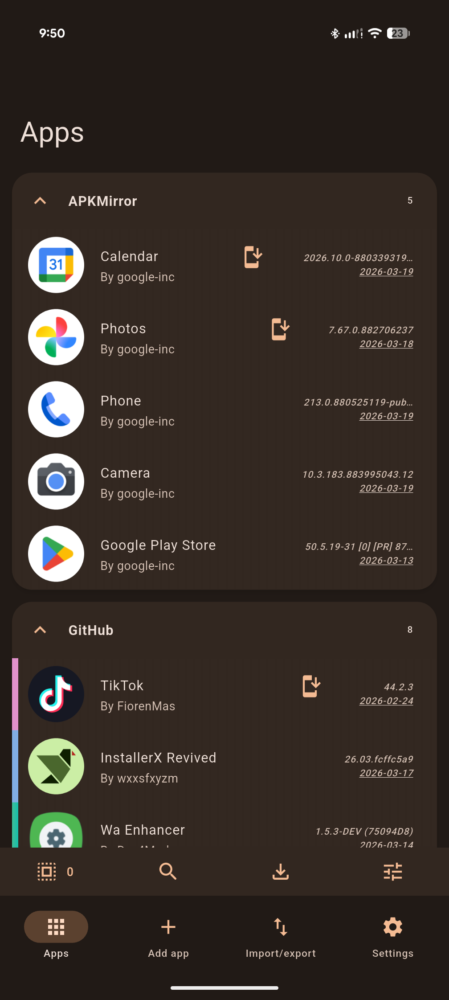
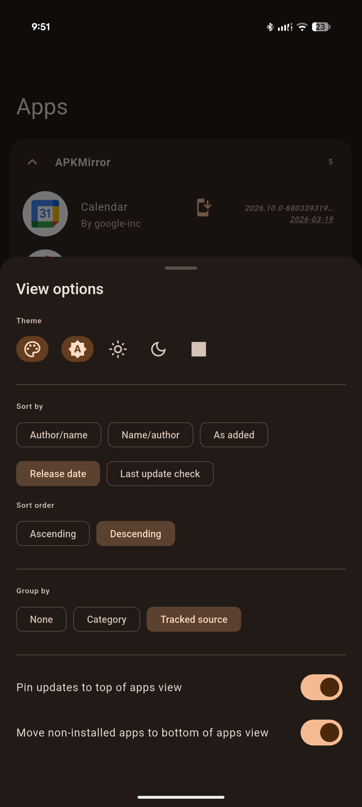
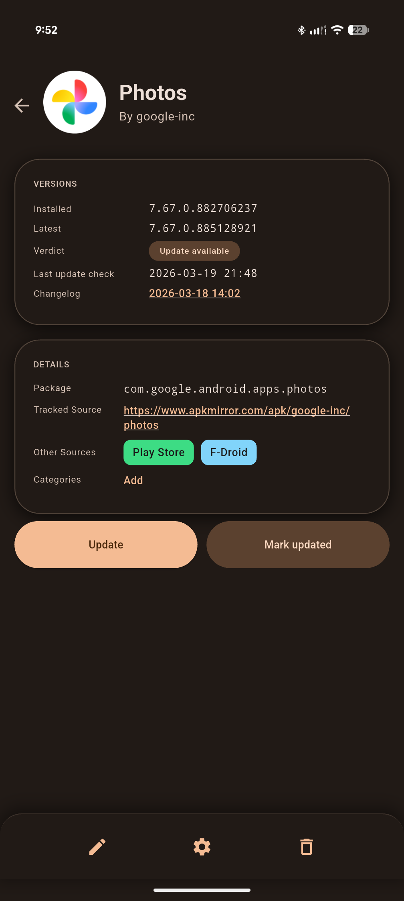
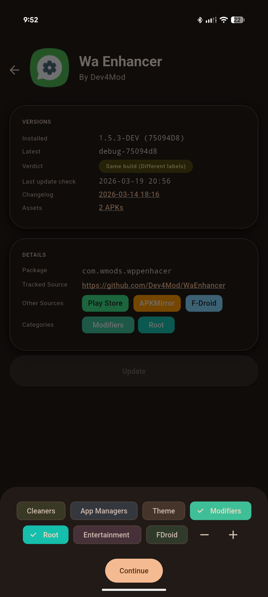

#  ObtainX

## Extra features in ObtainX

ObtainX is a fork of Obtainium. These are the extra features you get in this fork:

- **Installer choice** - Added a new **Legacy** install path. IT sends APKs to another installer you pick (e.g. InstallerX, App Manager). Useful when you cannot grant Obtainium "install unknown apps" permission (e.g. when _Advanced Protection_ is enabled) but another privileged installer can still install.

- **More Material UI** - Different parts of the app has been given some more Material UI love, with grouping in cards, slide up panels, expressive buttons, auto-hide menu bars, and small visual consistency tweaks. 

- **Better handling of Track-only sources (e.g. APKMirror)** 
  - Shows installed version from the device when the package ID is known; 
  - New **Update** button opens the concrete release page, not only the app listing. 
  - Fewer wrong package IDs when adding from APKMirror. 
  - If the installed version cannot be determined, a dedicated error section explains it and you can **fix the package ID** from the app page.

- **Organized App detail layout** 
  - Repalced plaintext heavy app page with Card-style sections (Hero, Versions, Details etc.), clearer grouping & hierarchy, Material 3 surfaces, and consistent treatment of links and timestamps.
  - **Other sources** - Other store shortcut chips on the app page.

- **Smarter version handling** - Fewer false "update available" / "up to date" states when your installed build and the source label differ in harmless ways (including dev vs release labels).

## Screenshots
|  |  |  | 
| ------------------------------------------------------ | ----------------------------------------------------------------------- | ----------------------------------------------------------------------- | 
|  |  |  | 

## Original Obtainium

Read the original Obtainium [README here](https://github.com/ImranR98/Obtainium/blob/main/README.md).
