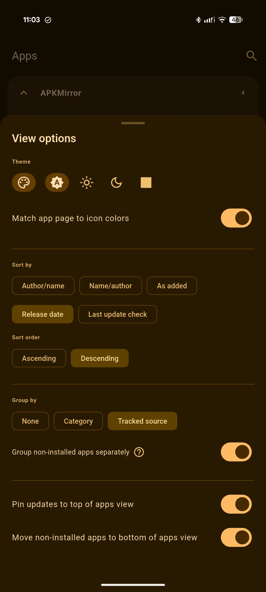
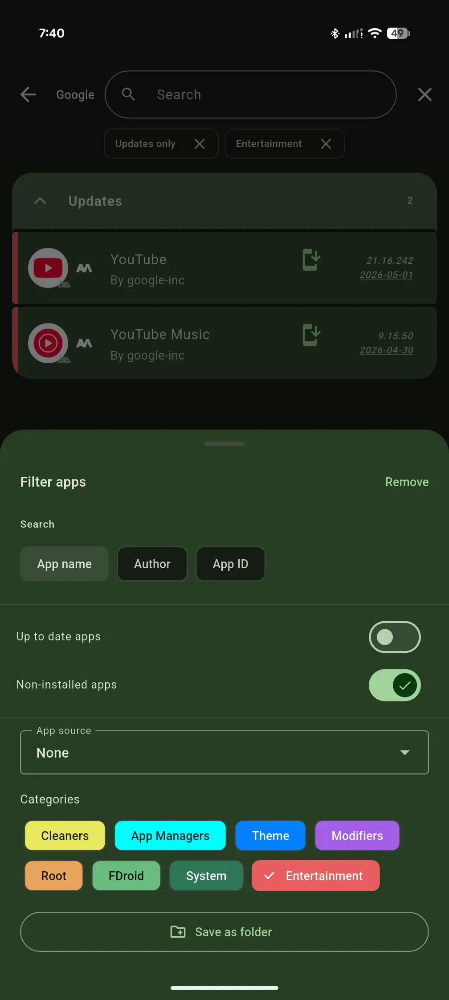
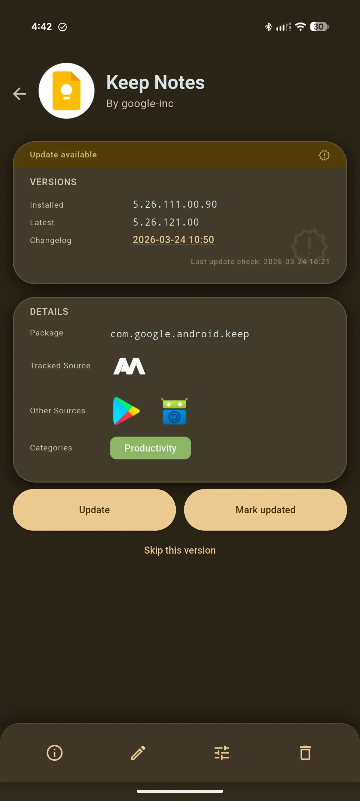
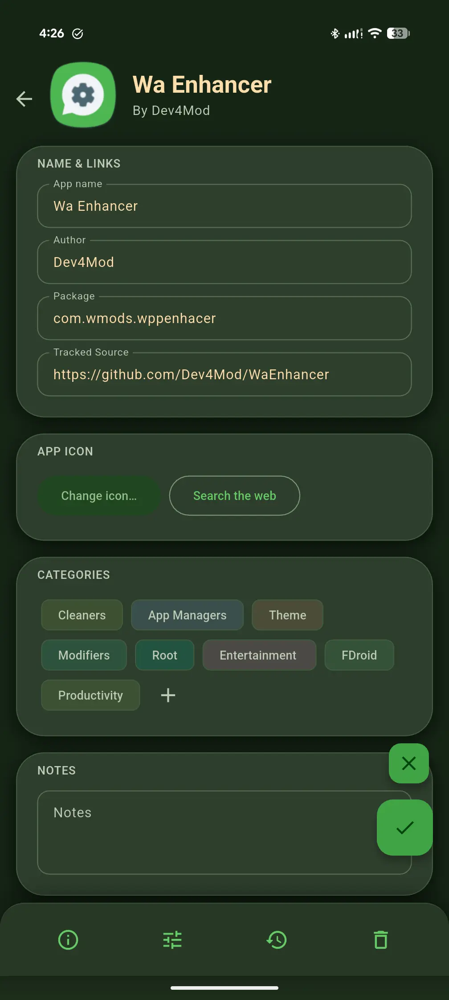
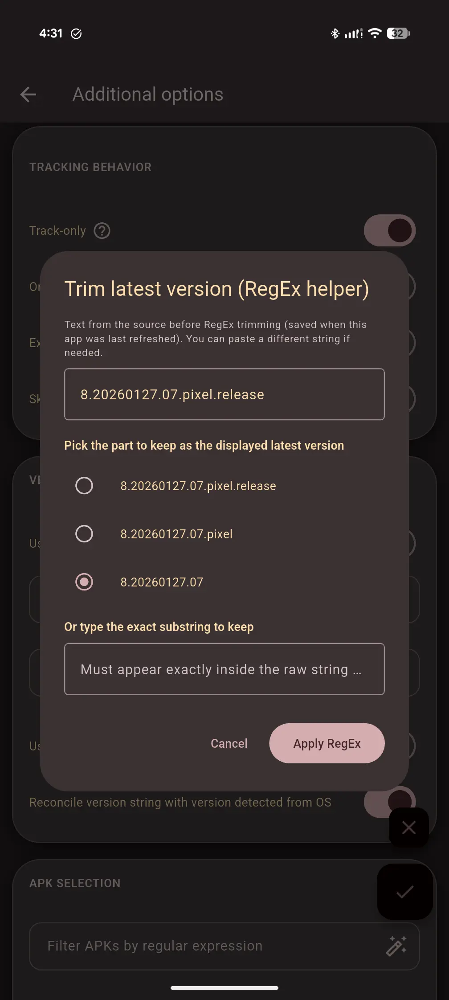
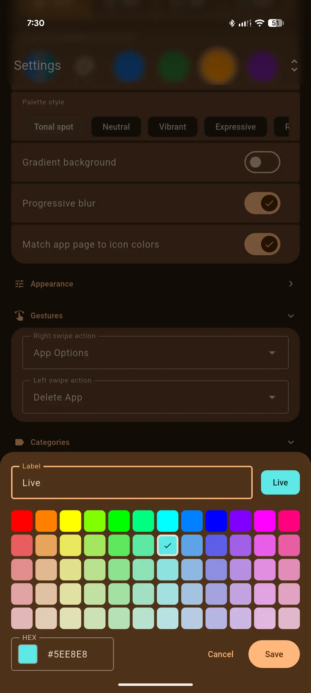
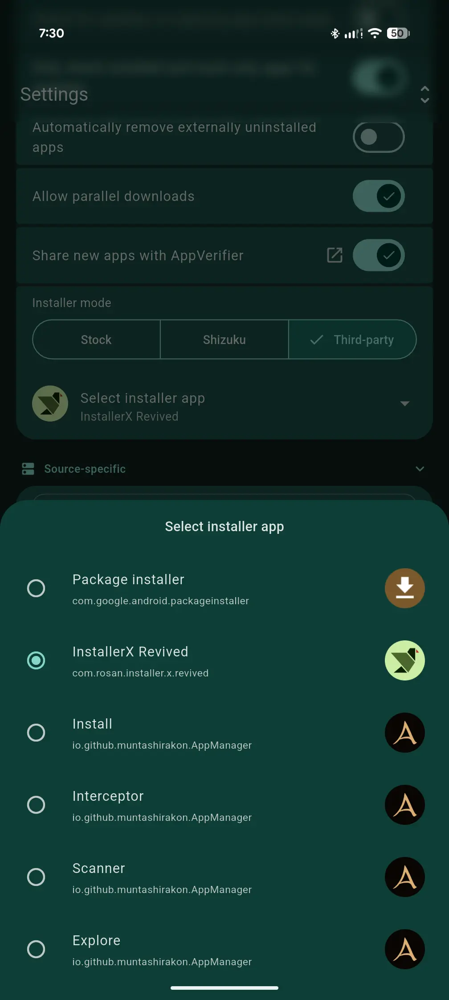

#  ObtainX

## Extra features in ObtainX

ObtainX is a fork of Obtainium. These are the extra features you get in this fork:

- **📦 Installer choice** - Added a **Third-Party** install path. It sends APKs to any installer you choose (e.g. InstallerX, App Manager). Useful when you cannot grant "install unknown apps" to normal apps (e.g. when _Advanced Protection_ is enabled) but a privileged installer can still do the job.

- **🎨 Material 3 Expressive Makeover** - Different parts of the app has been overhauled with Material 3 Expressive design, with grouping in cards, slide up panels, fluid animations, expressive buttons, auto-hide menu bars, and visual consistency tweaks. 

- **🎨 Per-app color theming** - Each app's detail page derives its entire color scheme from the app's own icon. Enable *Match app page to icon colors* in Settings to see every app rendered in its own palette - deep, accurate, and dark-mode-safe.

- **🖼️ Custom app icons** - Not happy with an app's icon or a blank placeholder? Tap the icon on any app's detail page to set your own - pick from your gallery or grab one from the web.

- **👆 Configurable swipe gestures** - Left and right swipe actions are independently configurable. Choose from Update, Install, Pin, Edit, Delete, Open, App Info, or None. A color-coded icon hint appears during the drag so you always know what will happen.

- **🔍 Collapsible inline search** - A search icon sits next to the **Apps** header. Tap it and a full-width search field slides open with the keyboard ready. See the app list filter live while you type. 

- **🔖 Active filter chips** - A pinned row of dismissible chips lives just below the toolbar, showing every active non-text filter (category, pinned, installed state, etc.). Tap any chip to instantly clear that filter. The row disappears entirely when nothing is filtered.

- **🏷️ Source favicon badges** - Every app row shows a tiny favicon badge identifying where the app comes from - GitHub, GitLab, F-Droid, APKMirror, and more - without opening the app.

- **↩️ Reliable undo after delete** - Swipe-to-delete and bulk-delete both show a 5-second **Undo** snackbar. Tap it and the app is fully restored.

- **🏪 Check other sources** - Other store shortcut chips on the app page.

- **🔭 Better handling of Track-only sources (e.g. APKMirror)** 
  - Shows the installed version from the device when the package ID is known. 
  - New **Update** button opens the concrete release page, not just the app listing. 
  - Fewer wrong package IDs when adding from APKMirror. 
  - If the installed version cannot be determined, a dedicated section explains why and lets you **fix the package ID** from the app page.

- **🧠 Smarter version handling** - Fewer false "update available" / "up to date" states when your installed build and the source label differ in harmless ways (including dev vs release labels).

## Screenshots
|  |  |  | 
| ------------------------------------------------------ | ----------------------------------------------------------------------- | ----------------------------------------------------------------------- | 
|  |  |  | 
|  |  |  | 

## Screenrecords

| | | |
| ------ | ------ | ------ |
| <video src="https://github.com/user-attachments/assets/de3c59fe-fae3-4177-bb09-473d16065384" width="320" controls muted></video> | <video src="https://github.com/user-attachments/assets/24e726cc-b8cf-40c2-a9fc-b5b0e024300b" width="320" controls muted></video> | <video src="https://github.com/user-attachments/assets/3fb396db-0bd3-40e4-a1e9-a250a2c39aa6" width="320" controls muted></video> |

## Original Obtainium

Read the original Obtainium [README here](https://github.com/ImranR98/Obtainium/blob/main/README.md).
